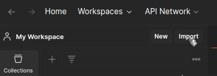
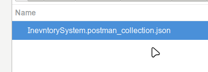
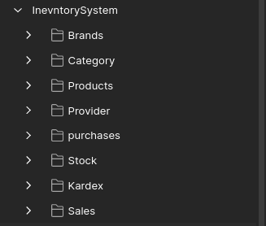
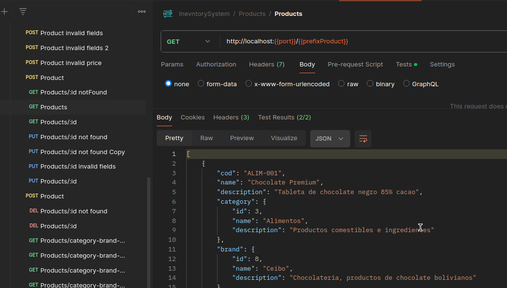

# Sistema de manejo de inventarios

Un proyecto desarrollado para el manejo de compras, ventas, inventario de productos de una tienda, con capacidad de
generar informes de ventas, ganancias, realizar el control de stock caducado, ver el estado de
productos que estan por quedarse sin stock y registrar ventas y poder realizar informe de ventas.

## Overview

Se realizo el analisis de requerimientos, la identificacion de la problematica principal y en base a esto se definio el
objetivo del proyecto, definiendo tambien historias de usuario expresando los requerimientos del producto.

Este analisis se encuentra en [Analisis sistema inventario](./analisis-requirements/Requirements.md)

Antes de empezar con la implementacion se realizaron los diagramas que previsualizan la interaccion de los servicios a
desarrollar de igual forma la interaccion con el usuario, la definicion de tablas en una base de datos y la separacion de
toda la logia en microservicios

Estos diagramas se encuentran en [Diagramas sistema inventario](./analisis-requirements/ClassesDatabaseDiagram.md)

## Estructura general


```text
.
├── analisis-requirements        # Documentación y análisis de requisitos
│   ├── docs-img                 # Imágenes y diagramas de soporte para la documentación
│   ├── ClassessDatabaseDiagram.md # Diagrama de clases y base de datos
│   ├── EndpointDoc.md            # Documentación de los endpoints de la API
│   └── Requirements.md           # Lista de requisitos funcionales y no funcionales del sistema
├── api-gateway                   # Servicio de puerta de enlace para enrutar solicitudes a los microservicios
├── artifacts                      # Recursos adicionales del proyecto
│   ├── mysql-init                 # Scripts de inicialización para la base de datos MySQL
│   ├── postman-integration-tests  # Colección de pruebas de integración en Postman
│   └── docker-compose.yml         # Configuración de Docker Compose para levantar los servicios
├── compra-service                 # Microservicio encargado de gestionar las compras
├── eureka-server                   # Servidor de descubrimiento de servicios (Eureka)
├── inventory-service               # Microservicio para la gestión del inventario de productos
├── producto-service                # Microservicio que maneja los productos disponibles
├── sale-service                    # Microservicio que administra las ventas
└── README.md                       # Archivo de documentación principal del proyecto
```


## Arquitectura

Despues del analisis realizado y los diagramas necesarios para entender el problema se escogio una arquitectura distribuida
en microservicios por las ventajas de la separacion de preocupaciones y en una vision de escalamiento del proyecto.
 En ese sentido para la arquitectura de cada microservicio se adopto una arquitectura **Hexagonal**.


Dentro de esta arquitectura se considera Puertos y adaptadores siguiendo un enfoque DDD ya que si en un futuro este proyecto 
tiende a crecer o se necesite hacer una migracion de BD o de alguna tecnologia este no interfiera o afecte al Domain

### Estructura de los microservicios

```text
.
├── src
│   ├── main
│   │   ├── java
│   │   │   └── com
│   │   │       └── tienda
│   │   │           └── server-name
│   │   │               ├── application
│   │   │               │   ├── services
│   │   │               │   ├── useCases
│   │   │               ├── domain
│   │   │               │   ├── abstraction
│   │   │               │   ├── model
│   │   │               │   └── port
│   │   │               ├── infraestructure
│   │   │               │   ├── adapters
│   │   │               │   │   ├── adapterimpl
│   │   │               │   │   ├── client
│   │   │               │   │   ├── entity
│   │   │               │   │   ├── exception
│   │   │               │   │   └── repository
│   │   │               │   └── rest
│   │   │               │       ├── advice
│   │   │               │       └── controller
│   │   │               └── MainServiceApplication.java
│   │   └── resources
│   │       ├── static
│   │       └── templates
│   └── test
```

- Dentro de **Domain** se encuentran todos los modelos del dominio dependiendo el microservicio estos no deben de cambiar, sino el resto del proyecto debe adaptarse a este.
- Dentro de **infraestructure** se encuentran los adaptadores al proyecto los cuales incluyen las implementaciones de los puertos definidos en el dominio, ademas se encuentran accesos a otros microservicios con clientes, y la definicion de entidades usando Jakarta persistance, de igual forma se encuentran los repositorios para el acceso a datos con JPA repository, se enuentran en infraestructura porque estos podrian cambiar y adapterse al dominio
- Dentro de **application** se encuentran los casos de uso interactuando con la capa de infraestructura y haciendo uso de los modelos definidos en el dominio.

## Stack utilizado

- Java 21
- Spring Boot 3.3.9
- MySQL 8
- Maven
- Spring Cloud (para comunicacion entre microservicios)
- Lombok (para reduccion de código repetitivo)
- MapStruct (para mapeo de DTOs y entidades)
- Feign Client (para integración con otros servicios)
- Eureka Client (para descubrimiento de servicios)

## Instalacion proyecto

1. Para la ejecucion del proyecto asegurate de tener **Docker y Docker Compose instalados** segun tu Sistema Operativo

    [Instalacion de Docker](https://docs.docker.com/engine/install/)

2. **Verificar la instalacion de Docker y Docker compose**

    En **Windows** PowerShell o CMD:
    
    ```bash
        docker --version
        docker compose version
    ```
   En **Linux** (Terminal):
    
    ```bash
        docker --version
        docker  version
    ```
    
    Si devuelve un error, probar con:
    
    ```bash
      docker- --version
    ```


3. **Levanta todos los servicios con Docker :**

    ```bash
      docker-compose -f artifacts/docker-compose.yml up -d
    ```
    
    o de forma alternativa
    
    ```bash
      docker compose -f artifacts/docker-compose.yml up -d
    ```
4. Verifica que los contenedores estén corriendo:
    ```bash
    docker ps
    ```
5. La aplicación estará disponible en http://localhost:8090

Si se necesita detener los servicios, ejecuta:

```bash
  docker-compose -f artifacts/docker-compose.yml down
```
o de forma alternativa 

```bash
  docker compose -f artifacts/docker-compose.yml down
```

## Uso del sistema de inventarios (Postman)

#### Los endpoints documentados del proyecto estan en [documentacion endpoints](./analisis-requirements/EndpointsDoc.md)

1. Descargar postman [download](https://www.postman.com/downloads/)

2. Abrir postman ir a la seccion de import

    

3. Buscar el file dentro del proyecto en la ruta ./artifacts/postman-integration-tests/InevntorySystem.postman_collection.json

    

    Se deverian poder visualizar las carpetas con las peticiones

    
    
    Se pueden realizar peticiones verificando diferentes validaciones

    
