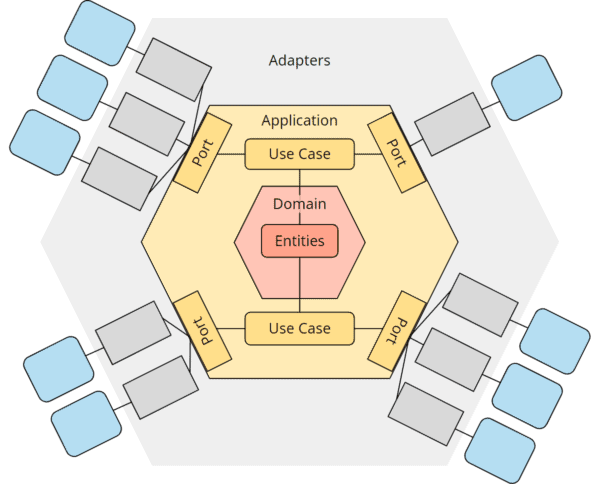

# Diagramas

Los siguientes diagramas se obtuvieron a partir del analisis de requerimientos [Requerimientos historias de usuario](./Requirements.md)

El primer analisis que se hizo es el diagrama de clases

## Diagramas de clases

La clase principal es el de producto, de la cual se componen las clases de Kardex, Detalle de ventas, Stock (lote), Detalle de Compra

Se crearon 2 clases adicionales para la clasificacion de los productos marcas y categorias (Brand) (Category)

En la clase Compra contiene una lista de detalle de compra, donde se especifican los productos que se incluyeron en esa compra, el precio con el que se compraron, su precio y cantidad, ademas de que tiene una agregacion del provedor quien provee el producto de dicha compra.

Analogamente en la Clase de Ventas se compone de una lista de detalles de venta, que contiene como agregado al Producto, la cantidad, el precio y la cantidad de la venta.

Finalmente se tienen las Clases de Stock y Kardex registran los movientos y la cantidad de productos que existe en el inventario, registraran ingresos y egresos de productos.

## Diagrama relacional BD

La base de datos que has diseñado esta pensada para gestionar el sistema de inventarios, cubriendo procesos de gestion de productos, compras, ventas, proveedores, marcas, categorías, y un registro detallado de movimientos de inventario (kardex). 

### Relaciones entre las tablas

- **brands y products:** Una marca puede tener muchos productos.

- **categories y products:** Una categoría puede tener muchos productos.

- **providers y purchases:** Un proveedor puede realizar muchas compras.

- **purchases y detail_purchases:** Una compra puede contener muchos detalles de productos.

- **products y detail_purchases:** Un producto puede aparecer en muchos detalles de compras.

- **products y kardex:** Un producto puede tener muchos registros de movimientos de inventario.

- **providers y stock:** Un proveedor puede suministrar muchos productos para el stock.

- **products y stock:** Un producto puede estar en muchas entradas de stock.
sales y sale_details: Una venta puede tener muchos detalles de productos vendidos.

- **products y sale_details:** Un producto puede aparecer en muchos detalles de ventas.

## Diagramas de Secuencias

Se pudieron identificar las principales secuencias de flujos dentro de la aplicacion, donde se muestran las interacciones del usuario con los microservicios, los mas importantes son:

### Registrar un nuevo producto

### Registrar compra

### Registrar Stock

### Consultar top productos
ompose up -d

### Consultar bajo stcok

### Ganancias por rango de fechas

### Productos por caducar

### Venta con politica FIFO

### Realizar una venta

## Diagrama C4

Finalmente se relizo un bosquejo de la arquitectura distribuida que este proyecto podria adoptar, esta la definimos mediante 2 digramas de C4 que inluyen:

### Diagrama de contexto

### Diagrama de contenedores

